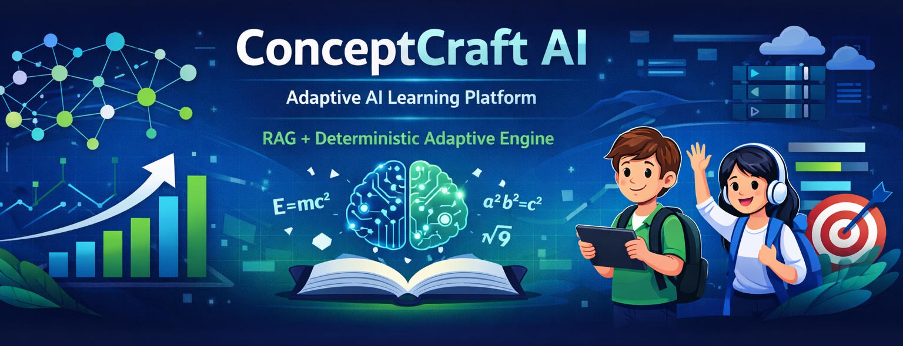

# ConceptCraft AI

<!-- METADATA: DO NOT REMOVE -->
<!-- domain: ai-platform -->
<!-- tags: AI, Education, RAG, Adaptive Learning, Node.js, React -->
<!-- featured: true -->
<!-- visibility: public -->
<!-- END METADATA -->



## 📋 Overview

ConceptCraft AI is a modular, AI-driven adaptive learning platform designed to deliver structured, practice-first education for K–12 students.

The platform combines **Retrieval-Augmented Generation (RAG)** with a **deterministic rule-based adaptive engine** to ensure reliable, mastery-based learning progression.

Unlike generic AI assistants, ConceptCraft AI separates **AI explanation generation** from **learning progression control**, enabling structured and measurable skill development while maintaining educational reliability.

---

## ✨ Features

- **Practice-First Learning** – Students learn through exercises before theoretical explanations.
- **AI-Powered Explanations** – RAG + LLM generates contextual explanations for incorrect answers.
- **Deterministic Adaptive Engine** – Rule-based progression ensures mastery before advancing.
- **Misconception Analysis** – AI identifies conceptual misunderstandings and explains them.
- **Difficulty-Layered Curriculum** – Concepts structured across grades and difficulty levels.
- **Structured Knowledge Retrieval** – Domain-constrained responses using RAG.
- **Performance Signal Tracking** – Tracks accuracy, time spent, and hint usage.
- **Scalable Modular Architecture** – Designed for scalable deployments across institutions.

---

## 🚀 Quick Start

### Prerequisites

- Node.js 18+
- MySQL 8+
- Redis (optional for caching)
- Docker (optional)
- AWS account for deployment

### Installation

```bash
# Clone the repository
git clone https://github.com/yourusername/conceptcraft-ai.git

# Navigate to project directory
cd conceptcraft-ai

# Install dependencies
npm install

# Set up environment variables
cp .env.example .env

# Run the application
npm run dev
```

### Configuration

```env
DATABASE_URL=mysql://localhost:3306/conceptcraft
LLM_API_KEY=your_api_key_here
PORT=3000
RAG_INDEX_PATH=./knowledge-index
CACHE_ENABLED=true
```

---

## 📖 Usage

### Basic Example

```javascript
const app = require('./app');

app.start({
  port: 3000,
  debug: true
});
```

### Advanced Usage

```javascript
const adaptiveEngine = require('./adaptive-engine');

adaptiveEngine.configure({
  difficultyScaling: true,
  misconceptionTracking: true,
  ragEnabled: true
});

adaptiveEngine.start();
```

---

## 🏗️ Architecture

```
conceptcraft-ai/
├── frontend/
│   ├── components/
│   ├── pages/
│   └── state/
├── backend/
│   ├── controllers/
│   ├── services/
│   ├── adaptive-engine/
│   └── utils/
├── ai-layer/
│   ├── rag/
│   ├── prompt-engineering/
│   └── response-parser/
├── database/
│   ├── schema/
│   └── seed-data/
├── docs/
└── config/
```

### Tech Stack

- **Frontend**: React, Tailwind CSS  
- **Backend**: Node.js, Express.js  
- **AI Layer**: Cloud-hosted LLM with Retrieval-Augmented Generation (RAG)  
- **Database**: MySQL + NoSQL Document Store  
- **Infrastructure**: AWS Cloud  

---

## 🧪 Testing

```bash
# Run all tests
npm test

# Run with coverage
npm run test:coverage

# Run specific test suite
npm test -- --grep "Adaptive Engine"
```

---

## 📊 Performance

- **Rule Engine Response Time**: <150ms  
- **AI Explanation Generation**: 1–3 seconds  
- **System Throughput**: Designed for large multi-school deployments  
- **Cost Optimization**: AI calls triggered only when needed  

Estimated operational cost:

₹35–₹45 per student per month

---

## 🔒 Security

- Secure API authentication  
- HTTPS-only communication  
- Input validation and sanitization  
- Student data isolation  
- Prompt safety validation for LLM responses  
- Protection against injection attacks  

---

## 🌐 API Documentation

### Endpoints

#### POST /api/validate-answer

Validate a student's submitted answer.

**Request**

```json
{
  "studentId": "12345",
  "exerciseId": "math_fraction_01",
  "answer": "3/4"
}
```

**Response**

```json
{
  "correct": false,
  "explanation": "Generated explanation from RAG + LLM",
  "nextExercise": "math_fraction_02"
}
```

---

## 🚢 Deployment

### Docker

```bash
# Build image
docker build -t conceptcraft-ai .

# Run container
docker run -p 3000:3000 conceptcraft-ai
```

### Production

```bash
# Build for production
npm run build

# Start production server
npm start
```

---

## 🤝 Contributing

Contributions are welcome.

1. Fork the repository  
2. Create a feature branch

```bash
git checkout -b feature/new-module
```

3. Commit your changes

```bash
git commit -m "Add new module"
```

4. Push to the branch

```bash
git push origin feature/new-module
```

5. Open a Pull Request

---

## 📝 License

This project is licensed under the MIT License.

See the **LICENSE** file for details.

---

## 👤 Author

**Your Name**

- GitHub: https://github.com/pankaj5536455 
- LinkedIn: https://linkedin.com/in/pankaj5536455
- Email: pankaj5536455@gmail.com  

---

## 🙏 Acknowledgments

- Open-source AI and education communities  
- Research on adaptive learning systems  
- Contributors and testers  

---

## 📈 Project Stats


---

## 🗺️ Roadmap

- [x] System architecture design  
- [x] Adaptive rule engine implementation  
- [x] RAG explanation system  
- [x] Curriculum data modeling  
- [x] Initial frontend learning interface  
- [x] **Version 1 Complete**  

Future roadmap:

- [ ] Multilingual learning support  
- [ ] Advanced learning analytics  
- [ ] Knowledge tracing models  
- [ ] Mobile learning interface  

---

## 📞 Support

For support, open an issue in this repository or contact the maintainers.

---

⭐ If you find this project useful, please consider giving it a star!
